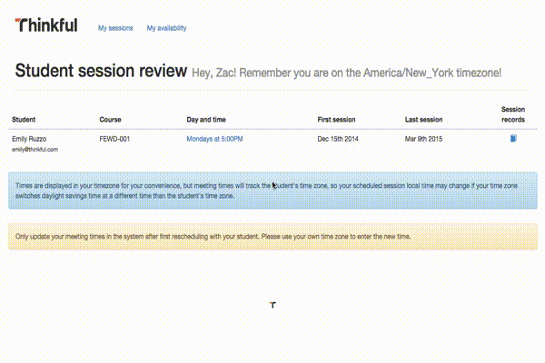
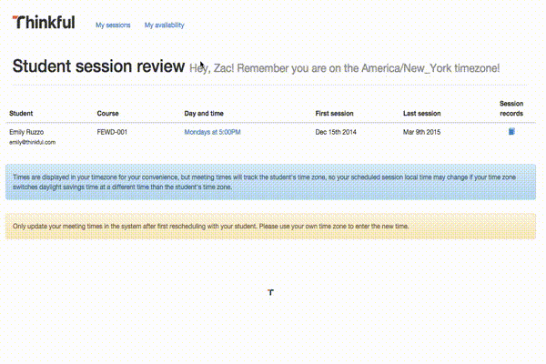
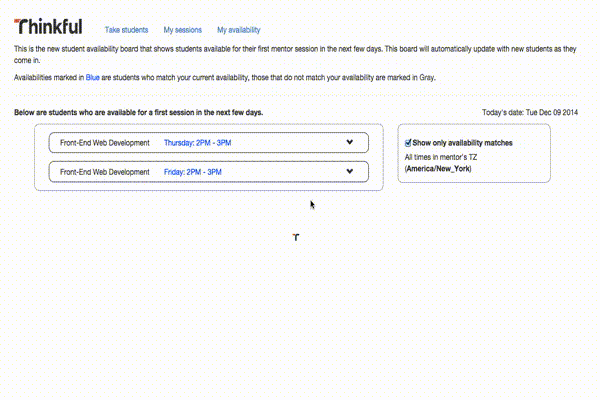

#Table of Contents

**Chapter 1** | Welcome to Thinkful!

**Chapter 2** | Mentorship Behind the Scenes

**Chapter 3** | Your First Mentor Session

**Chapter 4** | The Socratic Method and Other Awesome Coaching Strategies

**Chapter 5** | Mentor FAQ’s

**Chapter 6** | Conclusion

**Appendix** | Additional Resources for Mentors

---

##Chapter 1
###Welcome to Thinkful!

“If you give a man a fish, he will eat for a day. If you teach a man to fish, he will eat for life.” * This proverb is a great analogy for Thinkful’s mission!  

Thinkful was founded by Dan Friedman and Darrell Silver in 2012 in New York City. On a mission to reinvent education, Thinkful teaches the workforce sustainable career skills. 

Help us advance careers by providing goal oriented one-on-one mentorship to Thinkful students. Our courses are project-driven and supported by a thriving student community. We believe relationships drive learning. As a mentor, the relationships you build are essential for the success of both your students and our mission. We couldn’t be happier to have you on the team. Welcome to Thinkful!

\*Although we don’t currently cover fishing or phishing in any of our courses...

##Chapter 2
###Mentorship Behind the Scenes

Here’s a brief overview of the tools you will be using as a Thinkful Mentor.

 * Thinkful’s Learning App
 * Your Mentor Panel
 * Thinkful.com Email
 * Slack
 * GitHub
 * Video Chat

[**Thinkful’s Learning App**] (https://courses.thinkful.com) is home to all of our course content.  As a mentor, you have access to all of the content for each of our courses.  Students have access to the courses they’re enrolled in.

The [**Mentor Panel**](thinkful.com/patel/mentor_panel) is your administrative panel for students.  Once you have students, you’ll see each of them scheduled here.  For each scheduled mentor session you will record session notes.

Recording sessions is super important.  It’s the best way for you to keep track of your student’s goals and progress, and it’s a key internal metric at Thinkful.  If you aren’t sure how to properly record a session reach out right away.

You can also set and update your [availability](thinkful.com/user/#/availability) (keep an eye on the time zone!) and your student bandwidth.

We usually match students with mentors by hand, but now you can [claim available students](thinkful.com/patel/take_student/) on your own!

Your thinkful.com email is a [**Google Apps**](mail.google.com) account. Your Thinkful email is the primary way you’ll stay in touch with your students and with HQ.  We’ll reach out to this email with general announcements and actionable items like notifications about student project submissions.

We love [**Slack**](slack.comm).  We host the [student community](thinkful-students.slack.com) on one slack team and have another, [internal team](thinkful.slack.com), just for us.  You can think of these as the student lounge and the faculty lounge. Share resources, ask and answer questions, post invitations, promote projects, hang out and make friends across the globe!

You’ll use **video chat** for your weekly meetings with your students.  You’re set up with a default meetingplace at:

thinkful.com/hangout/[username]

where [username] is your @thinkful.com email address.  This link points to a permanent Google Hangout, though we’re currently experimenting with other technologies.  We’ll always share this with you and your students when we make an introduction, so make sure you both you and your student test this tool before your first session. 

We host all of our [**course content** on GitHub] (https://github.com/Thinkful-Ed/) as Markdown, which we then compile.  As a mentor, you’ll have access to the source code for the courses youll work with and you’re welcome to open issues or submit pull requests if you think we can make things better.

##Chapter 3
###Your First Mentor Session

#####Relationships drive learning
When students sign up for Thinkful they are excited to begin learning something new. The first 45 minutes you spend with any student is crucial for maintaining that excitement. You will have a successful first session if you achieve two things with your student:

+**Build a relationship**
+**Set learning goals**

You will have successful ongoing sessions if you set high expectations and routines with your student as well. 

####Before Your First Session

*Before your _first_ first session, familiarize yourself with the curriculum* 

Time: 1 HOUR

Take a look at the concepts and projects outlined in your course. Do this by logging into our [learning app] (https://courses.thinkful.com) and reading through your course or going to our [course pages] (http://www.thinkful.com) and reviewing the syllabus available. _What is being asked of your students? How long will it take them? What will their progress tell you?_ Take some time to anticipate questions and pain-points. 

Be prepared to suggest customized learning paths and pacing through course based on your student’s goals and experience. 

*Before every first session, send an email to your student*

Time: 5 MINUTES

Introduce yourself. Send a bio, a blog, a joke. Your students are curious about you and your professional experience! Begin building that relationship and tell them you are looking forward to meeting them at [CONFIRM DAY | TIME | TIMEZONE | LOCATION]. You may also want to include any relevant system set-up tips or tricks to help your student feel confident prior to your session. 

####During Your First Session
#####Build a relationship

Time: 15 - 25 MINUTES

Use the first session to learn about your student. Ask about their:
-work experience
-work habits
-coding experience _(ask follow up questions and get details)_
-past projects
-fun facts

By understanding what brought your student to Thinkful and knowing what their short and long term goals are you will be a more effective mentor. 

#####Set Ambitious and Achievable Goals

Time: 10 - 20 MINUTES

Tips for setting goals:
*listen and ask lots of questions of your student
*map students’ short term goals to the curriculum
*goals can task based or time based
*treat weekly goals as sprint goals and work with your student to define: why this goal, how to achieve it and your metric for success
*push back where goals are unrealistic

No matter how motivated students are, what courses they take, or how much they pay, students will not be able to achieve their goals unless they create conditions for rigorous learning. Spend time setting clear expectations about the course, what it covers and how it’s structured. We believe the value of Thinkful is found in time spent with you, their mentor. Explain ways in which student’s can maximize on their time with you each week. _Show up. Ask questions. Share work ahead of sessions. Etc._

Don’t be afraid to be honest with your student about the time commitment required to succeed. Taking a Thinkful course is like attending graduate school part time. Talk with your student about their work schedule and other commitments. Help them manage their time and encourage them reserve blocks on their calendar to devote to course work. This is an awesome undertaking and they must respect their own commitment to [the process] (http://norvig.com/21-days.html). 

>_"At this point a look of fear and of being overwhelmed sets in and I assure them that they are gonna knock it out of the park.  I'll usually tell them to not memorized specifics but memorize the concepts.” -Derek Fogge, Thinkful Mentor_

Remind students of resources to lean on outside of mentor sessions, a.k.a. #slack/stackoverflow/office-hours. Finally, set a specific goal for your student to achieve by your next meeting.

#####’Roll Up Your Sleeves’

Time: 0 - 20 MINUTES

While you will spend a large portion of this session simply talking with your new students we encourage you to be “as hands on as possible” during this session. Working through a screen-shared exercise may help to overcome any intimidation, increase curiosity and maintain excitement! Playing with code during a first session is especially important for students who are brand-new to programming or who may less clear about their goals. Below we’ve listed some activities to use with your students during your time together. 

####After Your First Session
**Completing Session Records**

Time: 10 MINUTES

Visit the Mentor Panel and fill out your session notes for the meeting. This is an essential way for you, and for us, to keep track of your student’s progress. Remember, students will never have access to these notes, so be honest about their level of engagement and their progress. 

At the end of your first session you should make note of your student’s:
*BACKGROUND
*SHORT TERM GOALS
*LONG TERM GOALS

**Cementing Communication Patterns**
Establishing routines with your students from the beginning will help you build a successful working relationship. Setting patterns and boundaries around when and how you plan to interact with your student will save everyone headache down the road. 

It’s a best practice to send your student a short email reminding them what you covered in your last meeting and what they are working on for the next week. Restate their learning goals for the week and the work schedule they committed to. Feel free to include any links or resources they might find helpful as they progress. 

Alternately, ask students to send you status updates prior to your next scheduled session. If you haven’t heard from them 48 hours before your next session, make contact, and outline a few ways you can make progress together at your upcoming session. 

Whichever approach you prefer, commit to it. 

##Chapter 4
###The Socratic Method and Other Coaching Strategies

A coach is someone who can give correction without causing resentment. - John Wooden

**Be a Coach**

Just like no two games are the same, no two sessions will be exactly alike. Every student has a different learning style, and it’s up to you to write their playbook. Hold your students accountable to themselves. Know their strengths and weaknesses. Plan drills and set training schedules. Use the strategies below to ensure every minute spent with your student is working toward achieving their goal. 

**Socratic Method**

The Socratic Method is ancient educational technology.  It’s also [state of the art](http://jorendorff.github.io/hackday/2013/tutoring).  Here’s an example:  Let’s say a student came and asked you: “Why doesn’t this Python code work?: `print ‘yes’ + 3`”

A **non-Socratic** response might be:  “_Because you can’t concatenate strings and integers._”

While that answer is *true*, it doesn’t help the student understand *why* you can’t add the two. 

A Socratic response might look like this:

 Mentor: “_What are you trying to do with this code?_”
 
 Student: “_I’m trying to print ‘yes’ and ‘3’ on the same line_”
 
 Mentor: “_Ok, what data type is ‘yes’?_”
 
 Student: “_It’s a string._”
 
 Mentor: “_Yup.  And what data type is ‘3’?_”
 
 Student: “_3 is an integer._”
 
 Mentor: “_Yup!  Now, can you concatenate a string and an integer in Python?_”

Summary: “What are you trying to do? What do we know about data types? How can we check what data types we’re dealing with? Is there a way for us to turn these into the same data type? Now what happens?”

As you can see, the Socratic response is not as quick as the simple answer, but the methodology is incredibly important. Encourage students to solve problems by engaging in a discourse which builds upon their prior knowledge. 

**Scaffolding**
 
You know how people say they “hit a wall” when learning something new? Scaffolding is building steps so anyone can safely climb over any wall of knowledge.
 
Some things Thinkful does to scaffold curriculum:
+ Breaking courses into assignments (mini-lessons)
+ Gradually increasing the complexity throughout the course
+ Having students commit projects intermittently so Mentors can view progress before students submit a completed project
+ Describing objectives in the unit/lesson intros

A few things you can do to scaffold curriculum:
+ Send students a list of terms to know before they start a lesson 
+ Relate new lessons/assignments to skills/concepts learned previously
+ Show students models or examples of what they will be building 
+ Share follow-up readings or set an additional stretch goal with your students

**Teach the Teacher**

As you probably know, teaching is a _great_ way to learn. Ask your students to teach you concepts they learned the prior week or used in recent projects. Articulating new concepts builds confidence, cements knowledge and will help students discover gaps in their learning. 

_Tip: This is a great technique to use when your student is rushing through material; take five and confirm they're retaining the concepts covered!_

**Code Tour**

Many students can make something that works without understanding *why* it works. Asking them to review their code and explain what each line does allows them to recognize the “why” behind each action. Be sure to call out areas that could be improved with questions like, “Why did you choose to call this method?” or “Are there any other ways that can be done?” In a code tour, you can also suggest other implementation alternatives, challenging the student to weigh all options.

**Code Review**

To come.

**Pair Programming**

Pair programming is a great way to teach students how to tackle problems and gives them incredible insight to a method that many programmers use every day. Read up on [Pair-Programming Styles] (http://agilerichmond.com/attachments/article/82/Pair%20Programming%20Handout.pdf). We recommend you be the navigator! Tools like madeye.io and nitrous.io are great for this, but feel free to suggest your favorite.

**Awesome Analogies**

Research proves that deep learning occurs when new knowledge is linked with prior knowledge. Analogies are a great way to do this. Use cars and their components to explain classes and fields, the animal kingdom to explain inheritance, shapes to explain polymorphism -- have fun with it!

**Personal Praise v. Process Praise**

Personal praise like, “Wow, you did an amazing job!” or, “You are so good at this!” does not increase student outcomes. Instead, it is more effective to provide feedback on a student's process by objectively stating how hard a problem was and acknowledging the student's problem solving approach or her work ethic. 

Similarly, avoid explicitly stating that your student has made a mistake. Let your students find their own errors. Provide hints by asking about specific lines of code and why they wrote them that way. Keep working backward until they are able to self-correct.

Learning requires tenacity. Internalizing pride takes work. Read more about [process praise here] (https://www.khanacademy.org/about/blog/post/95208400815/the-learning-myth-why-ill-never-tell-my-son-hes).

##Chapter 5
###Mentor FAQ’s

Here are some of the most common questions we get from mentors. Don’t see your question here? Email us or find us on slack! We’ll get back to you ASAP.

**The course uses one tool, I usually use another, is that ok?**

Yes. Part of being a mentor is sharing your best practices, workflows and tools with students. If want to introduce a tool you believe will serve your student’s long term goal, please share it with them (and be patient helping them set it up).

**My student wants to skip this week's session.**

Nope.  Use all of your power to make the meeting happen. As the course work gets tougher and life intervenes it gets tempting to skip sessions. Sometimes students think it’s a waste of time to meet if they haven’t made progress, but the opposite is true.  Ask them to commit to meeting for only 10 minutes even if they have no material prepared.

10 Minute Activities:
+ Share a best practice
+ Introduce developer tools
+ Start the next project together
+ Chat about tools or related dev news

**My student didn't do any work this week. At all.**

See “My student wants to skip this week’s session.”

**My student missed a couple sessions.**

Ok, so your student missed your first session, or they missed two in a row.  It happens. Here is what to do:

1. Log the missed session in your [mentor panel](thinkful.com/patel/mentor_panel) and make a note if you know why
2. Do your best to connect with the student and see if you two can reschedule within the week
3. Email support@thinkful.com so we can ping them as well

Support will be sure to copy you on emails with the student.  Sometimes people just disappear; if we never hear back we’ll go ahead and remove them from your calendar.

**My student is behind pace**
Thinkful courses are self paced, so students can’t _truly_ get behind pace.  That said, most students want to finish the course in a few months and it’s good to hold them accountable to those goals.  If a student falls behind the pacing goals they set for themselves be honest with them about their pace and motivate them to put in the hours each week to get back on top.

**What should I do if a student wants to go way off the curriculum?**

Confirm which skills and concepts they have mastered. (You should gain a good sense of this during your first session and you will watch the list grow each week.) From our experience, the courses provide foundations for building more advanced skills. Understanding concepts outside of the curriculum usually takes a strong grasp of curriculum content.

If you have a motivated student who wants to cover the course material and then extend to cover other topics, that’s great. Challenge them to complete a project and show you that they have the chops for advanced work. Only then is it appropriate to set "stretch" goals and training schedules for work which extends beyond the curricula.

**I won’t be able to attend this week’s session**

Life happens (even to the best of us!), and there may be sessions you simply can’t attend. When this happens, connect with your student and try to reschedule for another time *that same week*. If you expect to be absent for more than a week, or cannot reschedule with your student, email support@thinkful.com and we can either line up another mentor to cover or adjust your student’s enrollment period. 

If you are planning a vacation please let us know at least two weeks in advance so we can make plans for your students too!

**What do I invoice you for exactly?**

We estimate about an hour per week for each student, 45 minutes in session + 15 minutes dedicated to completing session records and corresponding with students. That said, we are more interested in successful student outcomes than a few extra minutes on an invoice. As long as you feel like your student is respecting your time and any communication boundaries you've set with them, you’re welcome to work with them and bill us for the time. Send invoices to invoices@thinkful.com.

If this starts to look like a different product model where your student sees you as “on-call” or you’re providing multiple sessions per week, let us know. Remind your student to attend office hours and leverage the student community for support as well!

##Chapter 6
###Conclusion

Like our students, we have curiosity, enthusiasm and grit.  We learn to refine our own expertise along the way. We hope this experience will enrich your career. Thinkful may not be your last job, but we want to make it the one you're most proud of. We also want it to be the most engaging one you have today. 

BE IN TOUCH. We are happy to hear from you with any question, comment or concern. 

[PROVIDE FEEDBACK ON THIS DOCUMENT HERE.] (http://goo.gl/forms/i836G4jiWX)
<!---
##Appendix
####Useful Resources for Mentors
Link to all survey responses
Below, find some tools our mentors already use and love. Please feel free to explore these resources and use those you find helpful. Or better yet make a PULL REQUEST to tell the community about your favorite trick or technique. We will publish(push?) it for the group!

**Tools**
Can't live without madeye.io
http://www.codeshare.io/ 
repl.it

**Words of Wisdom**

I try to make my students feel as though I am on their team, working together to find the solution in the code.

Do the assignments that the students have to do. This gives you a first hand experience to relate to the student with.
lways bring web development back to the real world. Give them examples/advice within the context of team based development as this is mostly the context we find ourselves in.

Always give answers/guidance within the context of good architectural principles. eg. code should always be simple and maintainable
Jr Intern

They learn a lot from seeing how you deal with not knowing something. If they only see you in a state of "totally knowing everything", they get discouraged because they aren't there yet. If they see you encounter a challenge, break it down, test/experiment, and try new things, that gives them hope, and insight into how they can face the unknown, and tackle it.

- Keep a repository of examples and put together a collection of metaphors that work for you in explaining foreign concepts such as: The DOM, event handling, selectors, jQuery, code structure, scope, variables, functions, http, AJAX)

- Add additional material that might be applied to their jobs.

- Session invites, I send them out 24 hours prior to the session. I have found that if I send them out any earlier than that, students tend to forget.

- Tough love, students are paying a good amount of money and it's our job to make sure that they dont' have to shell out more because they fell behind. Make sure you are clear with them that they are starting to fall behind and what they need to do to get back on track. Your students want to make you happy.

* Showing students how to work through a problem that you don't understand is extremely helpful. It's one thing to immediately spit out an answer, but it's a different matter when they see the mentor themselves not know an answer to a question or problem and work through it.

* Patience, patience, patience. We as teachers / mentors have the "curse of knowledge". It's easy to forget what it's like not to know something. Constantly trying to find new ways to explain things is an excellent exercise that solidifies our own knowledge as well as builds an arsenal of ways to teach different students the same subject.

Record yourself mentoring and watch it back. It's generally shocking, but you learn a lot about what you do well and badly.

Don't worry if you have a bad session - it happens. But after any bad session try to think about why it went badly, and what could have been done to change it.

Often as a mentor I find myself giving my students advice on being a freelancer, selling yourself, and really awesome SEO and online marketing blogs and websites to follow. I think it's equally as important to know how to market yourself as it is to be competent as a programmer.

This book is amazing for anyone involved in teaching or studying:

Make it Stick: The Science of Successful Learning
Peter C. Brown, et al
Belknap Press, 2014
-->

